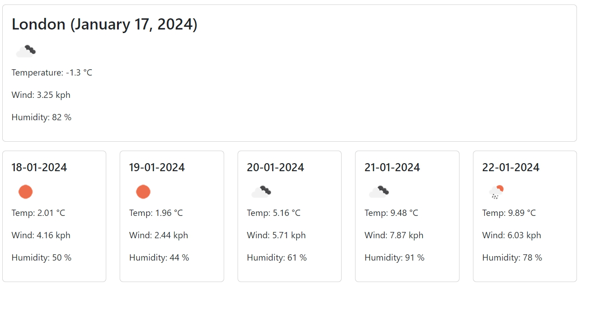

# Olga-weather-app

A weather dashboard which displays the current weather and 5-day forecast of a given location 

## Description

This weather dashboard showcases the jQuery, JavaScript, 3rd party API, Bootstrap, CSS & HTML skills I have gained from Module 8 (Server APIs) of the Front-end Web Development Bootcamp. 

## Usage

1. The **Weather Dashboard** can be accessed online on Github pages: [https://elismountain.github.io/Olga-weather-app/](https://elismountain.github.io/Olga-weather-app/) and the repo can be found: [https://github.com/elismountain/Olga-weather-app](https://github.com/elismountain/Olga-weather-app)

The user can enter a location in the search form
The current weather for the given location (Name, date, weather icon, temperature(°C), wind speed(kph) and humidity(%)) is displayed as well as the 5-day forecast (Weather data provided by Open Weather Map API). 
The search history for previously searched locations are displayed beneath the search form. Clicking on these buttons will reload the weather data for that location

## License

MIT License

